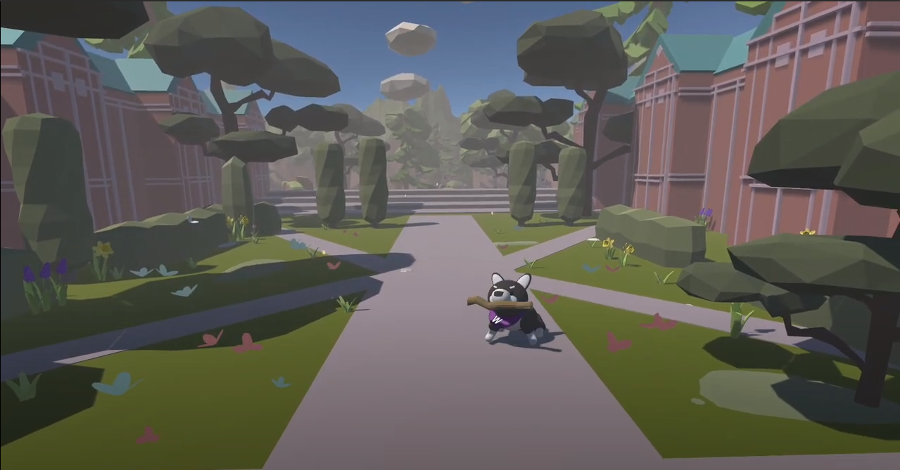

Project goHusky

This a a project adapted from [Puppo, The Corgi - Unity Blog](https://blog.unity.com/engine-platform/puppo-the-corgi-cuteness-overload-with-the-unity-ml-agents-toolkit) With update of 
# Project Name: goHusky

## Contents

1. [Modern Ways of Using ML-Agents Library Function Calls](#modern-ml-agents)
2. [UW-Themed Scene with Husky](#uw-themed-scene)
3. [Training Script Provided](#training-script)

## Modern Ways of Using ML-Agents Library Function Calls 

- Describe the modern ways of using ML-Agents library function calls in your project.
- Initialize()
- OnEpisodeBegin()
- CollectObservations(VectorSensor sensor)
- OnActionReceived(ActionBuffers actions)
- FixedUpdate()

## UW-Themed Scene with Husky 

- Showcase the UW-themed scene with the Husky character.

- [Demo](https://drive.google.com/file/d/16MwlWZDvgC36cPbYV7LD5hqD-6m4coSb/view?usp=drive_link)

## Training Script Provided 

- List and briefly explain each training script provided.
- Describe how users can run these training scripts.
- Mention any prerequisites or dependencies required for running the training scripts.

